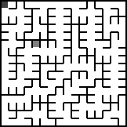

# micromouse_sim
Implementation of various maze generation and solving algorithms.

## Usage
```
❯ py main.py --help
usage: micromouse_sim [-h] [--rows ROWS] [--columns COLUMNS] (-g {dfs} | -l LOAD) -s {dfs,floodfill} [--frame-duration FRAME_DURATION]
                      [--cell-size CELL_SIZE]

generate and solve mazes using various algorithms

options:
  -h, --help            show this help message and exit
  --rows ROWS           number of rows in the maze (use only with -g/--generator)
  --columns COLUMNS     number of columns in the maze (use only with -g/--generator)
  -g {dfs}, --generator {dfs}
                        algorithm to use for generating the maze
  -l LOAD, --load LOAD  spec file to load maze from
  -s {dfs,floodfill}, --solver {dfs,floodfill}
                        algorithm to use for solving the maze
  --frame-duration FRAME_DURATION
                        frame duration in output gif
  --cell-size CELL_SIZE
                        size of each cell in output gif
```

Example invocation: `py main.py --generator=dfs --rows=16 --columns=16 --solver=floodfill`


## Demos



DFS solver (left) vs Floodfill solver (right) on the same maze.
