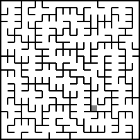

# micromouse_sim
Implementation of various maze generation and solving algorithms.

## Usage
```
> py main.py --help
usage: micromouse_sim [-h] -g {dfs} -s {dfs,floodfill} [--fps FPS] [--cell-size CELL_SIZE] rows columns

generate and solve mazes using various algorithms

positional arguments:
  rows                  number of rows in the maze
  columns               number of columns in the maze

options:
  -h, --help            show this help message and exit
  -g {dfs}, --generator {dfs}
                        algorithm to use for generating the maze
  -s {dfs,floodfill}, --solver {dfs,floodfill}
                        algorithm to use for solving the maze
  --fps FPS             fps of output video
  --cell-size CELL_SIZE
                        size of each cell in output video
```

Example invocation: `py main.py 16 16 --generator=dfs --solver=floodfill`


## Demos


